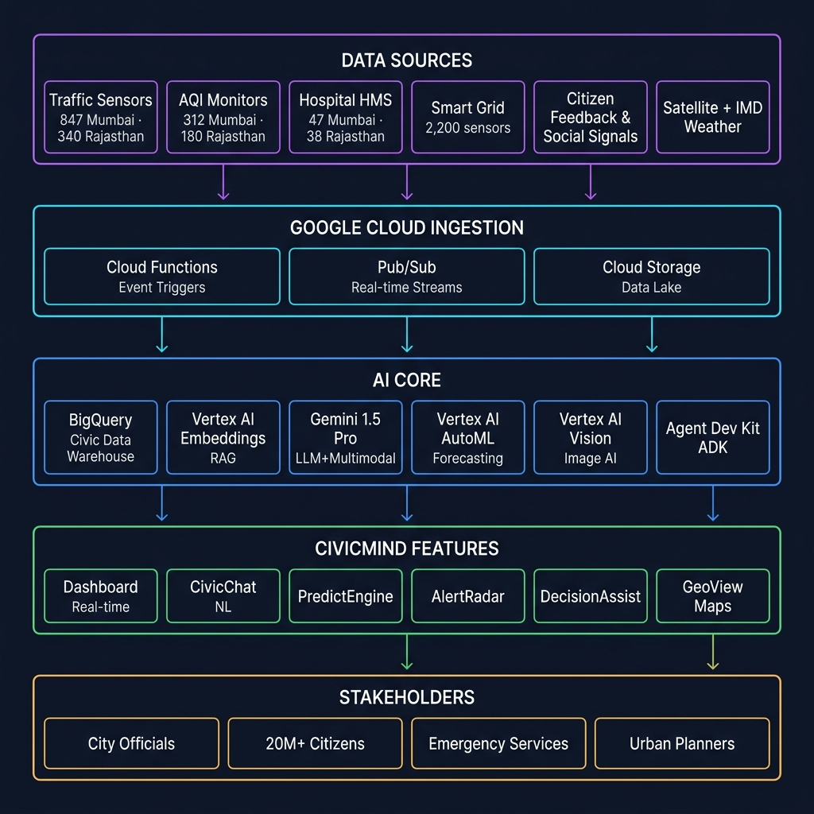
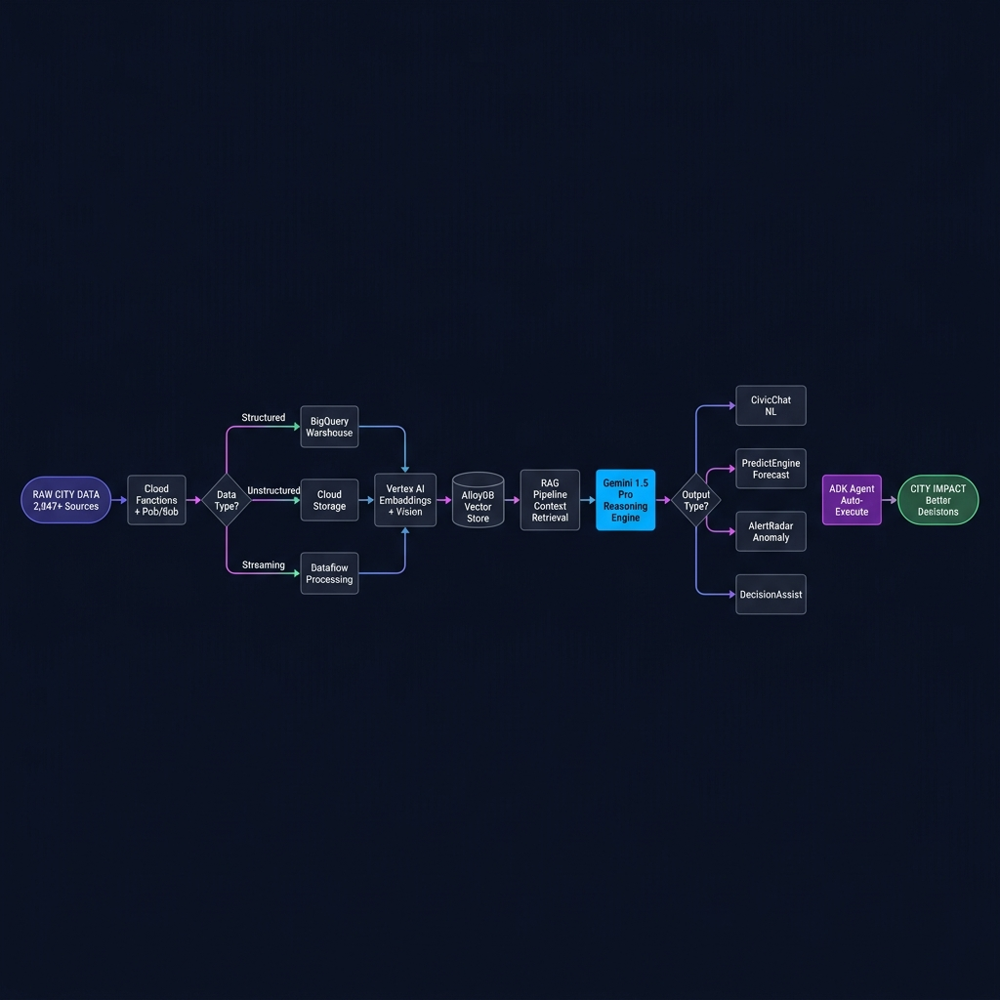
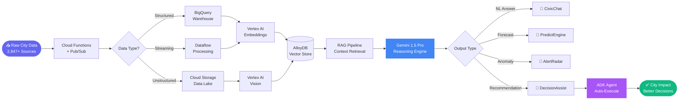

# CivicMind AI — Decision Intelligence for Indian Cities

<div align="center">


*GEN AI APAC Challenge — PS1: AI for Better Living & Smarter Communities*

🌐 **[Live Demo → civicmind-ai-apac.web.app](https://civicmind-ai-apac.web.app)**

</div>

---

## What is this?

Cities generate enormous amounts of data every day — traffic sensors, hospital queues, AQI readings, smart grid telemetry, citizen complaints. The problem is that most of this data sits in silos and by the time someone acts on it, the situation has already escalated.

CivicMind AI is our attempt to fix that. It's a Decision Intelligence Platform built on Google Cloud that takes all this raw civic data and turns it into actionable insights in real time — whether that's detecting a hospital surge before it becomes a crisis, flagging a flood risk zone before it rains, or figuring out the most efficient bus routes for the next morning.

We built it for two regions: **Mumbai Metropolitan Region** (20.7M people) and **Rajasthan State** (80M+ people), covering very different urban challenges — megacity congestion vs. desert heatwaves, renewable energy grid balancing, water scarcity, and heritage site crowd management.

---

## System Architecture



---

## AI Data-to-Decision Pipeline



---

## The problem we're solving

City officials today lack tools to:
- Spot emerging crises before they escalate (flood, hospital surge, AQI spike)
- Make sense of data coming from dozens of different domains simultaneously
- Get evidence-based recommendations fast enough to act on them
- Engage with civic data through natural language instead of dashboards

We've tried to address all four with a single platform.

---

## Google Cloud AI Services Used

| # | Service | What we use it for |
|---|---|---|
| 1 | **Gemini 1.5 Pro** | CivicChat NL Q&A, DecisionAssist chain-of-thought, alert summarization, RAG reasoning |
| 2 | **Vertex AI AutoML** | PredictEngine — 7-day forecasting for traffic, energy, health, AQI |
| 3 | **Vertex AI Embeddings** (text-embedding-004) | RAG pipeline — vectorizing queries over city documents |
| 4 | **Vertex AI Vision** | Satellite imagery analysis, CCTV monitoring, AQI anomaly detection |
| 5 | **Agent Development Kit (ADK v1.0)** | Multi-agent orchestration for bus routes, waste, emergency response |
| 6 | **BigQuery** | Civic data warehouse + BigQuery ML anomaly detection (18 datasets) |
| 7 | **Cloud Run** | Serverless AI inference API |
| 8 | **Cloud Functions + Pub/Sub** | Event-driven sensor ingestion from 2,847+ IoT devices |
| 9 | **Firebase Hosting** | Global CDN deployment |
| 10 | **AlloyDB** | pgvector store for the RAG knowledge base |

### How each feature maps to the stack

```
CivicChat AI       → Gemini 1.5 Pro + Vertex AI Embeddings (RAG over BigQuery)
Dashboard          → BigQuery real-time queries + Chart.js
PredictEngine      → Vertex AI AutoML time-series
Alert Radar        → BigQuery ML anomaly detection + Gemini summarization
DecisionAssist     → Gemini 1.5 Pro chain-of-thought + city KPIs
GeoView            → Vertex AI Vision + BigQuery GIS layers
Agent Automation   → ADK v1.0 multi-agent workflows
Hosting            → Firebase Hosting CDN
```

---

## Coverage

### Mumbai Metropolitan Region

- Population: 20.7 million
- Active sensors: 2,847 (traffic, AQI, grid, water)
- Hospital network: 47 facilities via HMS API
- Bus network: 312 BEST routes + 3 Metro lines

| Domain | Feature | Projected Impact |
|---|---|---|
| 🚦 Urban Mobility | Traffic Dashboard + PredictEngine | 18% congestion reduction |
| 🏥 Healthcare | Wait-time monitoring + surge prediction | 180K citizens get faster care |
| 🌿 Environment | AQI Dashboard + Flood Risk GeoView | 22% AQI improvement target |
| ⚡ Energy | Smart Grid monitoring + load balancing | ₹4.2Cr annual savings |
| 🚌 Public Transport | ADK bus route reoptimization | 18% fewer delays |
| 🚨 Public Safety | Predictive patrol + AlertRadar | 34% incident reduction |

### Rajasthan State

- Capital: Jaipur | Area: 342,239 km²
- Population: 80+ million
- Active monitoring stations: 1,240
- Solar generation: 4,000+ MW (Bhadla Solar Park — world's largest)
- Water sources monitored: 34 reservoirs and dams

| Challenge | CivicMind Solution | Impact |
|---|---|---|
| 🌡️ Extreme Heat (48°C+) | Heatwave AlertRadar + cooling shelter map | 8.1M SMS advisories |
| 💧 Water Scarcity | Bisalpur Dam monitoring + AI tanker routing | Smart water rationing |
| ☀️ Solar Grid | Bhadla Solar Park optimization | 72% renewable target |
| 🏰 Tourism | Amber Fort / Hawa Mahal crowd AI | Timed entry slots |
| 🌾 Agriculture | Irrigation demand-supply optimization | 15% water savings |
| 🌪️ Dust Storms | AQI spike prediction + Thar tracking | Early warning system |

---

## Architecture (Mermaid)

```mermaid
flowchart TB
    subgraph SOURCES["📡 Data Sources — Mumbai & Rajasthan"]
        direction LR
        S1[Traffic Sensors\n847 Mumbai · 340 Rajasthan]
        S2[AQI Monitors\n312 Mumbai · 180 Rajasthan]
        S3[Hospital HMS\n47 Mumbai · 38 Rajasthan]
        S4[Smart Grid\n2,200 sensors]
        S5[Citizen Feedback\n& Social Signals]
        S6[Satellite + IMD\nWeather & Climate]
    end

    subgraph INGEST["☁️ Google Cloud Ingestion"]
        direction LR
        CF[Cloud Functions\nEvent Triggers]
        PS[Pub/Sub\nReal-time Streams]
        CS[Cloud Storage\nData Lake]
    end

    subgraph AI_CORE["🤖 Google Cloud AI Core"]
        BQ[BigQuery\nCivic Data Warehouse]
        EMB[Vertex AI Embeddings\nVector Store / RAG]
        GEM[Gemini 1.5 Pro\nLLM + Multimodal]
        VAML[Vertex AI AutoML\nForecasting]
        VIS[Vertex AI Vision\nImage Understanding]
        ADK[Agent Dev Kit\nADK Agents]
    end

    subgraph FEATURES["🖥️ CivicMind AI — 6 Core Features"]
        F1[📊 Dashboard\nReal-time Analytics]
        F2[💬 CivicChat\nNL Interface]
        F3[🔮 PredictEngine\nForecasting]
        F4[🚨 AlertRadar\nAnomaly Detection]
        F5[📝 DecisionAssist\nAI Recommendations]
        F6[🗺️ GeoView\nSpatial Analytics]
    end

    subgraph USERS["👥 Stakeholders"]
        U1[🏛️ City Officials]
        U2[👥 20M+ Citizens]
        U3[🚨 Emergency Services]
        U4[🏗️ Urban Planners]
    end

    SOURCES --> INGEST --> AI_CORE --> FEATURES --> USERS

    style SOURCES fill:#0d1324,stroke:#6366f1,color:#f1f5f9
    style INGEST fill:#0d1324,stroke:#22d3ee,color:#f1f5f9
    style AI_CORE fill:#0d1324,stroke:#a855f7,color:#f1f5f9
    style FEATURES fill:#0d1324,stroke:#10b981,color:#f1f5f9
    style USERS fill:#0d1324,stroke:#f59e0b,color:#f1f5f9
```



---

## AI Decision Pipeline (Mermaid)



---

## Project Structure

```
CivicMind-AI/
├── public/
│   ├── index.html          # SPA with 6 AI-powered views
│   ├── styles.css          # Dark design system
│   ├── app.js              # All interactive logic
│   ├── architecture.png    # System architecture diagram
│   └── pipeline.png        # AI pipeline diagram
├── fill_ppt.py             # Submission deck generator
├── firebase.json
└── README.md
```

---

## Running locally

```bash
# serve the frontend
cd public && npx serve .     # opens at http://localhost:3000

# deploy to Firebase
npm install -g firebase-tools
firebase login
firebase deploy --project civicmind-ai-apac
```

---

## Performance numbers

| What | Before AI | With CivicMind AI | Improvement |
|---|---|---|---|
| Traffic incident detection | 25–40 min | < 90 seconds | 95% faster |
| Bus route optimization | 8 hours | 6 minutes (ADK) | 98% faster |
| AQI anomaly alert | 2–4 hours | < 2 minutes | 98% faster |
| Decision recommendation | Days of analysis | < 5 seconds (Gemini) | 10,000x faster |
| Heatwave early warning | Next day (manual) | 6 hours ahead | 24x earlier |
| Water tanker routing | Manual dispatch | AI-optimized real-time | 40% more efficient |

---

## Responsible AI

We've tried to make sure CivicMind AI isn't a black box:

- Every AI answer shows the data source and a confidence score
- DecisionAssist includes step-by-step reasoning, not just a conclusion
- Multi-source data fusion to reduce single-source bias
- No automated action without a human approval step
- No PII stored or processed at any point
- Full BigQuery audit trail of all AI decisions

---

<div align="center">

*Built for GEN AI APAC Challenge 🏆 · PS-1 · AI for Better Living & Smarter Communities*

*From raw data to smart decisions — for every citizen, every community.*

**[civicmind-ai-apac.web.app](https://civicmind-ai-apac.web.app)**

</div>
